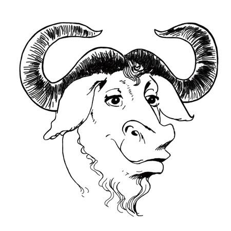

====================
GNU [GNU]_
====================

.. [GNU] http://www.gnu.org/gnu/about-gnu.html

关于GNU 作业系统
「GNU」的名称是「GNU's Not Unix」的递回式头文字缩写！意即「GNU并非Unix」。其英语发音为实念出g子音的单音节字，华语（汉语官话）发音类似「革奴」。

GNU是理查・史托曼（Richard Stallman，他本人常用的缩写为rms）在1983年启动的专案，旨在为了所有软体使用者的自由而以互助合作方式共同打造出人人都能控制其电脑运作的作业系统。rms现在仍是专案的Chief GNUisance。[按1]

GNU的主要目标和永续目标是要提供百分百自由软体构成的Unix相容作业系统。不是95%自由，也不是99.5%自由，而是100%自由。作业系统的名称——GNU，是「GNU's Not Unix」的递回式头文字缩写，这个称呼是要向Unix所开创的技术想法致敬，但同时指出GNU和它不一样。技术上而言，GNU类似Unix；但与Unix不同，GNU给予使用者自由。

时至今日完全自由的系统散布版 （英文简称「distro」）已能达成这个目标，其中有许多采用Linux-libre 作为内核心（GNU与Linux内核心之间的种种关系详细写在其他地方）。我们设计的GNU软体包能互相搭配而成就有用的GNU系统。这些软体包也是许多distro的共同「上游」，所以能为GNU软体包做出贡献可以让全体自由软体社群一同受益。当然，GNU专案的工作仍持续进行，目标是打造出给予电脑使用者最大自由的系统。GNU软体包涵盖使用者导向的应用软体、公用程式、工具、函式库、甚至游戏等——即一套作业系统中所有能提供给使用者方便运用的程式。我们随时欢迎新软体包的加入。

GNU专案因为有数千人的参与而有今天的成果。我们有许多种贡献方式，包括技术性和非技术性事务。GNU开发者三不五时会在GNU Hackers Meetings聚会，有时会也会在大型自由软体社群LibrePlanet会议中碰面。

GNU一直以来有许多事务是由自由软体基金会(FSF)支援。自由软体基金会是rms所创立的非营利组织，主要倡导自由软体的想法。此外，自由软体基金会也接受GNU软体的著作权让渡和弃权声明，所以能在法庭上能代表GNU软体。（特别澄清，贡献程式到GNU专案不必转移著作权给FSF。如果你决定让渡著作权的话，FSF就能在有人侵犯程式的GPL条款时行使著作权；但如果你决定保留著作权，则行使权在你自己身上。）

最终目标是要提供让使用者能运用电脑完成其所想所有事务的自由软体——如此得以让专有软体成为过去事。

