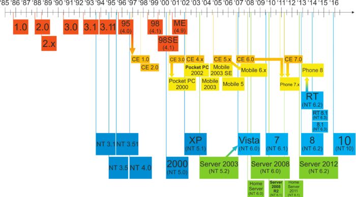

======================================================================
What is Windows Desktop? [Windows]_ [1]_
======================================================================
.. image:: ../images/windows.png

by

.. image:: ../images/microsoft.png

.. [Windows] https://www.microsof.com/en-us/windows/

.. [1] https://en.wikipedia.org/wiki/Microsoft_Windows/

Microsoft Windows是一组图形 操作系统家族，所有这些都是由微软开发，销售和销售的。每个家庭都迎合计算行业的某个部门。活动Windows家族包括Windows NT和Windows Embedded ; 这些可能包含子族，例如Windows Embedded Compact（Windows CE）或Windows Server。不活动的Windows系列包括Windows 9x，Windows Mobile和Windows Phone。

